# AI Production Evaluation Platform

A cloud-native RAG system that benchmarks and monitors its own serving stack, then
exposes an **agentic retrieval interface** so an engineer can ask natural-language
questions about performance results, bottlenecks, and architectural trade-offs and
get a grounded, cited answer with a full decision trace.

Four Python services (API gateway, agent, retrieval, inference) plus a React
client, PostgreSQL + pgvector, and Redis. It runs CPU-only for local development
and CI; the inference hop swaps to vLLM or Triton/TensorRT-LLM by configuration
alone for a GPU deployment.

- **Quickstart** &rarr; [below](#quickstart)
- **Primary demo (CPU, browser)** &rarr; [below](#primary-demo)
- **Architecture** &rarr; [below](#architecture) · per-edge detail in [`docs/diagrams/architecture.md`](docs/diagrams/architecture.md)
- **Results** &rarr; [Evaluation and results](#evaluation-and-results) · full report in [`docs/performance-report.md`](docs/performance-report.md)
- **Limitations** &rarr; [below](#limitations)

## Quickstart

**Prerequisites:** Python 3.11, Node 20, and Docker with Compose. A Kubernetes
path (`kind` or Minikube) is optional and covered under [Deployment](#deployment).

```bash
git clone <repo-url> AI-RAG-Platform
cd AI-RAG-Platform

python3 -m venv .venv && source .venv/bin/activate
make install          # editable installs for the four services + web deps

make lint             # ruff + tsc
make test             # Python pytest (476 pass, 1 skipped) + web vitest
```

`make test` needs no GPU, no model download, and no running database: the
retrieval service falls back to a bundled four-document corpus and the inference
service uses a deterministic in-process backend. That same offline configuration
is what CI runs — see [Continuous integration](#continuous-integration).

To run the whole system, bring up the Docker Compose stack:

```bash
cd infra/compose
docker compose up --build
```

| Surface | URL | Notes |
| --- | --- | --- |
| Web client | <http://localhost:3000> | React SPA served by nginx |
| API gateway | <http://localhost:8000> | `POST /chat`, `GET /health` — the only app entrypoint |
| Retrieval service | <http://localhost:8002> | `POST /documents` for ingestion, `POST /search` |
| Prometheus | <http://localhost:9090> | scrapes `/metrics` on every service |
| Grafana | <http://localhost:3001> | dashboard *RAG Platform Overview*; anonymous viewer, admin/admin |

With Compose up, PostgreSQL and Redis are running, so ingested documents persist
and retrieval uses pgvector + the Redis cache rather than the offline fallback.

## Primary demo

A grounded answer from a document you ingested, entirely on CPU.

**1. Start the stack** (`docker compose up --build` from `infra/compose/`).

**2. Ingest a document.** Ingestion is on the retrieval service, not the public
gateway:

```bash
curl -sS -X POST http://localhost:8002/documents \
  -H 'Content-Type: application/json' \
  -d '{"documents": [{
        "id": "latency-postmortem-2207",
        "title": "Latency postmortem · run #2207",
        "source": "docs/postmortems/2207.md",
        "content": "The p95 regression traced to the retrieval hop: cache hit rate fell to 24% after the corpus reload, so most queries hit pgvector cold. Restoring the warm cache brought p95 from 512 ms back to 143 ms.",
        "tags": ["retrieval", "cache", "p95", "latency"]
      }]}'
```

**3. Ask about it in the browser.** Open <http://localhost:3000> and ask:

> What brought the p95 regression down in run #2207?

The answer quotes the ingested text, cites it as `[1]`, and the evidence panel
shows the decision trace — `Plan → Retrieve → Assess evidence → Generate` — with
per-step timings. Asking the same question again returns `X-Cache: HIT` on the
internal `/search` call and skips the vector store.

**Without the browser**, the same path over `curl`:

```bash
curl -sS -X POST http://localhost:8000/chat \
  -H 'Content-Type: application/json' \
  -H 'X-Request-ID: demo-001' \
  -d '{"question": "What brought the p95 regression down in run #2207?"}'
```

Every response — success or error — echoes `X-Request-ID`. Follow one request
across all four services with the recipe in
[`docs/operations/observability.md`](docs/operations/observability.md).

**Offline variant.** `python scripts/run_local_stack.py` starts the four services
with no database; retrieval then answers from the bundled corpus in
[`services/retrieval/src/retrieval_service/corpus.py`](services/retrieval/src/retrieval_service/corpus.py).
Sample questions it can answer are in
[`load-tests/dataset/questions.json`](load-tests/dataset/questions.json), e.g.
*"How much did cache misses raise vector-search p95 latency at 32 concurrent
users?"*

## Architecture

```mermaid
flowchart TB
    browser["Web client&#10;React + TypeScript SPA (nginx :80)"]

    subgraph cluster["Kubernetes namespace &mdash; Ingress is the only external surface (/ &rarr; web, /api/* &rarr; api-gateway)"]
        direction TB
        gw["API gateway&#10;FastAPI :8000 &mdash; POST /chat"]
        agent["Agent service&#10;:8001 &mdash; POST /answer&#10;bounded RAG workflow"]
        retr["Retrieval service&#10;:8002&#10;POST /search, POST /documents"]
        inf["Inference service&#10;:8003 &mdash; POST /generate&#10;backend: deterministic | vllm | triton"]
        pg[("PostgreSQL + pgvector&#10;:5432 &mdash; document store (2Gi PVC)")]
        redis[("Redis&#10;:6379 &mdash; retrieval cache")]
    end

    subgraph gpu["GPU runtime &mdash; overlays/gpu (nodeSelector gpu=true, nvidia.com/gpu)"]
        vllm["vLLM server (in-cluster in the overlay)"]
        triton["Triton / TensorRT-LLM (documented alternative)"]
    end

    subgraph obs["Observability"]
        otel["OpenTelemetry Collector"]
        prom["Prometheus"]
        graf["Grafana"]
    end

    browser -->|"HTTPS via Ingress"| gw
    gw --> agent
    agent -->|"POST /search"| retr
    agent -->|"POST /generate"| inf
    retr --> pg
    retr --> redis
    inf -.->|"VLLM_BASE_URL"| vllm
    inf -.->|"TRITON_BASE_URL"| triton

    gw -.->|"traces + metrics"| otel
    agent -.-> otel
    retr -.-> otel
    inf -.-> otel
    otel --> prom
    prom --> graf
```



Solid edges are request/dependency paths; dashed edges are telemetry or optional
remote-backend connections. Per-edge detail is in
[`docs/diagrams/architecture.md`](docs/diagrams/architecture.md); the decision to
split into services is [ADR-0001](docs/decisions/0001-service-oriented-monorepo.md).

| Component | Choice | Why |
| --- | --- | --- |
| Frontend | React + TypeScript | Realistic but lightweight investigation UI. |
| API Gateway | FastAPI | Python-first, async, one narrow public contract (`POST /chat`). |
| Agent Service | Python | Runs the retrieval decision, one bounded query rewrite, and answer synthesis. |
| Retrieval | PostgreSQL + pgvector | Keeps vector search next to the document store; no extra database. |
| Cache | Redis | Cuts repeat-query latency; `X-Cache` makes hit/miss visible. |
| Inference | deterministic \| vLLM \| Triton/TensorRT-LLM | One contract, three backends; GPU stacks are comparable under equivalent settings. |
| Containers | Docker | Reproducible services; the foundation for Kubernetes. |
| Orchestration | Kubernetes (Kustomize) | Deployments, Services, Ingress, HPAs, probes, resource limits, GPU scheduling. |
| Observability | OpenTelemetry + Prometheus + Grafana | One request followed end to end; latency attributed per hop. |

## Request Flow

The agent runs a fixed, bounded decision loop &mdash; not an open-ended agent.
Full detail, including the trace steps and error contract, is in
[`docs/diagrams/request-flow.md`](docs/diagrams/request-flow.md).

```mermaid
flowchart TB
    q["Browser: POST /api/chat&#10;{ question }, optional X-Request-ID"]
    gw["API gateway: POST /chat&#10;validate, propagate request id"]
    ans["Agent: POST /answer &mdash; run_workflow"]
    plan{"Plan &mdash; retrieval needed?"}
    direct["Answer directly&#10;(greeting or capability question)"]
    retr["Retrieve &mdash; retrieval POST /search&#10;Redis cache: HIT serves cached,&#10;MISS &rarr; pgvector search then store&#10;(X-Cache: HIT | MISS | BYPASS)"]
    assess{"Assess evidence &mdash;&#10;a citation with relevance &ge; 0.3?"}
    rewrite["Rewrite query, retrieve once more,&#10;keep the stronger evidence"]
    gen["Generate &mdash; inference POST /generate&#10;grounded prompt from usable citations"]
    resp["200 &mdash; answer + citations + step trace&#10;echoes X-Request-ID"]

    q --> gw --> ans --> plan
    plan -- no --> direct --> resp
    plan -- yes --> retr --> assess
    assess -- "strong" --> gen
    assess -- "weak, steps remain" --> rewrite --> gen
    gen --> resp
```



- **Bounds.** `WorkflowConfig(min_relevance=0.3, min_results=1, max_steps=4)`:
  at most two retrievals and one generation per request; hitting the step limit
  returns a safe fallback answer.
- **Caching.** Retrieval checks Redis before pgvector and reports the outcome in
  the `X-Cache` header on `/search`.
- **Failure translation.** A retrieval timeout becomes `504 agent_timeout`; an
  inference outage or unreachable agent becomes `503 agent_unavailable`; an
  invalid body is `422 validation_error`. No path returns a bare `500`.
- **Observability.** Every stage emits an OpenTelemetry span and every response
  carries `X-Request-ID`, so a trace shows where request time was spent.

## Deployment

| Target | Command | What it is |
| --- | --- | --- |
| CPU stack | `docker compose up --build` in `infra/compose/` | Full app + Postgres + Redis + OTel/Prometheus/Grafana. The demo path above. |
| Local Kubernetes | `kubectl apply -k infra/kubernetes/overlays/local` | Single-node `kind` cluster; bring-up steps in [`infra/kubernetes/overlays/local/README.md`](infra/kubernetes/overlays/local/README.md). |
| GPU inference | `kubectl apply -k infra/kubernetes/overlays/gpu` | Adds an in-cluster vLLM Deployment and repoints inference at it; prerequisites in [`infra/kubernetes/overlays/gpu/README.md`](infra/kubernetes/overlays/gpu/README.md). |

The Kustomize **base** ([`infra/kubernetes/base/`](infra/kubernetes/base/)) is
environment-independent — 7 Deployments and 7 Services — and includes:

- startup / readiness / liveness probes on every workload;
- CPU and memory requests and limits on every container;
- an **Ingress** that exposes only the web app (`/`) and the API gateway
  (`/api/*`, prefix-stripped); every other Service is `ClusterIP` with no rule;
- a 2Gi `ReadWriteOnce` PVC with a `Recreate` strategy for PostgreSQL
  (data-loss expectations for local clusters are in the local overlay README);
- CPU `HorizontalPodAutoscaler`s for api-gateway, agent, and retrieval;
  inference, web, postgres, and redis are fixed-replica by design;
- GPU scheduling in the `gpu` overlay: `runtimeClassName: nvidia`,
  `nodeSelector: gpu=true`, an `nvidia.com/gpu` taint toleration, and a
  `nvidia.com/gpu: 1` request/limit on the vLLM pod only.

Manifests are checked two ways: `make k8s-validate` renders every Kustomize
target offline and asserts invariants (namespace, probes, resource requests,
replica-count vs. HPA ownership, Service/Ingress/HPA references resolve);
`make k8s-smoke` checks a live deployment after `kubectl apply`.

**Inference backend selection is configuration only.** `INFERENCE_BACKEND` picks
`deterministic` (default, CPU, used by CI and every test), `vllm`, or `triton`;
the remote backends read `VLLM_BASE_URL` / `TRITON_BASE_URL`. Pinned runtime
configs and model-startup notes are under [`runtimes/`](runtimes/). Opt-in smoke
scripts (`scripts/smoke_vllm.py`, `scripts/smoke_triton.py`) drive the real
adapters against a GPU server.

## Observability

`rag_observability.instrument_app` wires every service identically: structured
JSON logs, OpenTelemetry traces (FastAPI + httpx instrumented, W3C
`traceparent` propagated), and Prometheus metrics on `/metrics`. Spans exist for
the agent decisions, keyword/vector search, cache access, and generation; metrics
cover request rate, latency, errors, cache hit/miss/bypass, retrieval query time,
and generation duration and token counts. The Compose stack provisions a Grafana
dashboard over all of it. Reference and PromQL:
[`docs/operations/observability.md`](docs/operations/observability.md).

## Evaluation and results

### Quality

```bash
make eval-quality         # writes evaluation/reports/quality-latest.{json,md}
make eval-quality-check    # same run, fails on a threshold regression
```

The harness runs [`evaluation/datasets/quality-core-v1.json`](evaluation/datasets/quality-core-v1.json)
(15 cases — direct answers, retrieval, rewrites, insufficient-evidence) through
the deterministic stack and scores retrieval recall/MRR/precision@1, citation
presence and accuracy, answer correctness, and hallucination rate. Every run
records dataset version and hash, backend and model, workflow thresholds, judge,
and commit SHA.

CI gates on [`evaluation/quality/thresholds.json`](evaluation/quality/thresholds.json)
— recall ≥ 1.0, MRR ≥ 0.9, precision@1 ≥ 0.9, citation presence ≥ 1.0, citation
accuracy ≥ 0.85, answer correctness ≥ 1.0, hallucination rate ≤ 0.0 — enforced by
`test_quality_regression.py` inside the normal pytest run. The committed dataset
currently passes all of them.

### Performance

```bash
make load-run SCENARIO=steady-state    # start stack, run scenario, tear down, summarize
```

The full write-up — setup, per-hop attribution, the optimization, and its
limitations — is [`docs/performance-report.md`](docs/performance-report.md).
Summary of what the telemetry showed on the CPU-only single-host stack:

- The chat path is **fixed-overhead-bound, not hotspot-bound**. End-to-end
  latency is spread across four ASGI/httpx hops; the retrieval query is ~9% of
  its hop and deterministic generation ~3% of its.
- The largest single slice (~32%) was the gateway hop, which transforms nothing
  but was validating, re-validating, and re-serializing the agent's response
  under `response_model`. Removing the redundant pass is an isolated **−68%** on
  that response path (100 µs → 32 µs on an 8.2 KB payload); end to end it sits
  under the ±2 ms host-noise floor, which the report states plainly.
- **Comparisons that need more infrastructure** — cached vs. uncached retrieval,
  basic vs. agentic RAG, vLLM vs. Triton/TensorRT-LLM — are written up as
  method (scenarios, config flags, metrics to read) in
  [`evaluation/performance/README.md`](evaluation/performance/README.md), not
  reported with numbers, because Redis/Postgres and a GPU host were not available
  where the measured numbers were taken. No figure in the report is projected.

## Continuous integration

[`.github/workflows/ci.yml`](.github/workflows/ci.yml) runs on every push to
`main` and every pull request, in three parallel jobs:

| Job | Runs |
| --- | --- |
| `python` | `make install-python`, `make lint-python` (ruff), `pytest tests/contracts`, `make test-python` (full suite incl. integration + end-to-end) |
| `web` | `npm ci`, `npm run lint` (tsc typecheck), `npm test -- --run` (vitest), `npm run build` |
| `manifests` | `pip install -r scripts/requirements.txt`, install pinned `kubectl` v1.25.4, `make k8s-validate` |

All three run without a GPU, a model download, or a live cluster.

## Repository layout

| Path | Responsibility |
| --- | --- |
| `apps/web/` | React and TypeScript web client. |
| `services/` | Independently packaged API gateway, agent, retrieval, and inference services. |
| `libs/observability/` | Shared logging / tracing / metrics instrumentation. |
| `runtimes/` | Pinned vLLM and Triton/TensorRT-LLM runtime configuration. |
| `evaluation/` | Offline quality and performance evaluation and their datasets. |
| `load-tests/` | Locust scenarios and dataset; raw results stay local. |
| `contracts/` | Versioned OpenAPI schemas exchanged across service boundaries. |
| `infra/` | Docker Compose, Kubernetes (Kustomize), and observability configuration. |
| `tests/` | Cross-service contract, integration, and end-to-end tests. |
| `docs/` | ADRs, diagrams, operations runbooks, and the performance report. |

Each service owns its dependencies, unit tests, and Dockerfile, and talks to the
others only over the contracts in `contracts/` — never by importing their code.

## Limitations

- **Benchmarks are CPU-only, single host, loopback networking.** Absolute
  latencies are not representative of a cluster; the transferable finding is the
  *shape* (overhead spread across hops). Run-to-run noise is ≈ ±2 ms on
  end-to-end percentiles.
- **The default inference backend is deterministic**, not a model. It measures
  the platform overhead *around* inference. A real model would dominate
  end-to-end latency and move the bottleneck to the inference hop.
- **The offline retrieval fallback** is a keyword scan over four bundled
  documents. pgvector, the embedding model, and the Redis cache are exercised
  only with the Compose (or Kubernetes) stack up.
- **The GPU path is configured and documented but was not run here** — no GPU in
  the build environment. `runtimes/` configs are pinned and the smoke scripts
  drive the production adapters; reproducing the numbers needs a compatible GPU
  host.
- **Local Kubernetes is a throwaway environment.** The Postgres PVC does not
  survive `kind delete cluster`; Redis is cache-only and starts cold. See the
  local overlay README.
- **Model-judged answer scoring exists as a tested seam but is never in the
  default run** — it is non-deterministic. The keyword judge is the CI baseline.

## Key trade-offs

| Decision | Trade-off |
| --- | --- |
| Microservices vs. monolith | Realistic scaling and failure isolation, but more moving parts and per-hop overhead. |
| pgvector vs. dedicated vector DB | Simpler stack, one datastore; less specialized vector-search tuning. |
| vLLM vs. Triton/TensorRT-LLM | vLLM is easier to operate; Triton/TensorRT-LLM offers deeper NVIDIA optimization and serving control. |
| Agentic RAG vs. basic RAG | Handles weak first retrieval via one bounded rewrite, at the cost of a second retrieval on those requests. |
| Local Kubernetes vs. managed cloud | Free and enough to demonstrate orchestration; not equivalent to operating a production cluster. |
| Redis caching | Lower repeat-query latency, but cache invalidation on corpus change to manage. |
| REST vs. gRPC | Simpler to debug and inspect; less efficient than gRPC for internal calls. |
