# AI Production Evaluation Platform

A **cloud-native AI system** that benchmarks and monitors its own performance, then uses an agentic RAG interface to let engineers investigate performance results, identify bottlenecks, and compare architectural configurations using natural-language questions.

## Architecture

```mermaid
flowchart TB
    browser["Web client&#10;React + TypeScript SPA (nginx :80)"]

    subgraph cluster["Kubernetes namespace &mdash; Ingress is the only external surface (/ &rarr; web, /api/* &rarr; api-gateway)"]
        direction TB
        gw["API gateway&#10;FastAPI :8000 &mdash; POST /chat"]
        agent["Agent service&#10;:8001 &mdash; POST /answer&#10;bounded RAG workflow"]
        retr["Retrieval service&#10;:8002&#10;POST /search, POST /documents"]
        inf["Inference service&#10;:8003 &mdash; POST /generate&#10;backend: deterministic | vllm | triton"]
        pg[("PostgreSQL + pgvector&#10;:5432 &mdash; document store (2Gi PVC)")]
        redis[("Redis&#10;:6379 &mdash; retrieval cache")]
    end

    subgraph gpu["GPU runtime &mdash; overlays/gpu (nodeSelector gpu=true, nvidia.com/gpu)"]
        vllm["vLLM server (in-cluster in the overlay)"]
        triton["Triton / TensorRT-LLM (documented alternative)"]
    end

    subgraph obs["Observability"]
        otel["OpenTelemetry Collector"]
        prom["Prometheus"]
        graf["Grafana"]
    end

    browser -->|"HTTPS via Ingress"| gw
    gw --> agent
    agent -->|"POST /search"| retr
    agent -->|"POST /generate"| inf
    retr --> pg
    retr --> redis
    inf -.->|"VLLM_BASE_URL"| vllm
    inf -.->|"TRITON_BASE_URL"| triton

    gw -.->|"traces + metrics"| otel
    agent -.-> otel
    retr -.-> otel
    inf -.-> otel
    otel --> prom
    prom --> graf
```

Solid edges are request/dependency paths; dashed edges are telemetry or optional
remote-backend connections. Per-edge detail is in
[`docs/diagrams/architecture.md`](docs/diagrams/architecture.md).

| Component | Choice | Why |
| --- | --- | --- |
| Frontend | React + TypeScript | Matches the JD's JavaScript requirement and keeps the UI realistic but lightweight. |
| API Gateway | FastAPI | Python-first, async, simple API design, easy service boundaries. |
| Agent Service | Python | Runs tool-calling, query rewriting, retrieval decisions, and answer synthesis. |
| Retrieval | pgvector | Keeps vector search close to Postgres and avoids adding another database for a portfolio project. |
| Cache | Redis | Demonstrates caching, queueing, and bottleneck reduction. |
| Inference | vLLM + Triton/TensorRT-LLM | Directly maps to the JD and enables performance comparison between inference stacks. |
| Containers | Docker | Reproducible services and required foundation for Kubernetes. |
| Orchestration | Kubernetes | Demonstrates deployments, services, ingress, autoscaling, probes, resource limits, and GPU scheduling. |
| Observability | Prometheus + Grafana + OpenTelemetry | Measures system health and traces latency across services. |

## Request Flow

The agent runs a fixed, bounded decision loop &mdash; not an open-ended agent.
Full detail, including the trace steps and error contract, is in
[`docs/diagrams/request-flow.md`](docs/diagrams/request-flow.md).

```mermaid
flowchart TB
    q["Browser: POST /api/chat&#10;{ question }, optional X-Request-ID"]
    gw["API gateway: POST /chat&#10;validate, propagate request id"]
    ans["Agent: POST /answer &mdash; run_workflow"]
    plan{"Plan &mdash; retrieval needed?"}
    direct["Answer directly&#10;(greeting or capability question)"]
    retr["Retrieve &mdash; retrieval POST /search&#10;Redis cache: HIT serves cached,&#10;MISS &rarr; pgvector search then store&#10;(X-Cache: HIT | MISS | BYPASS)"]
    assess{"Assess evidence &mdash;&#10;a citation with relevance &ge; 0.3?"}
    rewrite["Rewrite query, retrieve once more,&#10;keep the stronger evidence"]
    gen["Generate &mdash; inference POST /generate&#10;grounded prompt from usable citations"]
    resp["200 &mdash; answer + citations + step trace&#10;echoes X-Request-ID"]

    q --> gw --> ans --> plan
    plan -- no --> direct --> resp
    plan -- yes --> retr --> assess
    assess -- "strong" --> gen
    assess -- "weak, steps remain" --> rewrite --> gen
    gen --> resp
```

- **Bounds.** `WorkflowConfig(min_relevance=0.3, min_results=1, max_steps=4)`:
  at most two retrievals and one generation per request; hitting the step limit
  returns a safe fallback answer.
- **Caching.** Retrieval checks Redis before pgvector and reports the outcome in
  the `X-Cache` header on `/search`.
- **Failure translation.** A retrieval timeout becomes `504 agent_timeout`; an
  inference outage or unreachable agent becomes `503 agent_unavailable`; an
  invalid body is `422 validation_error`. No path returns a bare `500`.
- **Observability.** Every stage emits an OpenTelemetry span and every response
  carries `X-Request-ID`, so a trace shows where request time was spent.

## Deployment

Run the full stack locally with Docker and Kubernetes (`kind` or Minikube). GPU workloads are isolated behind the inference service so they can run locally when available or in a free NVIDIA GPU environment.

## Repository Layout

| Path | Responsibility |
| --- | --- |
| `apps/web/` | React and TypeScript web client. |
| `services/` | Independently packaged API gateway, agent, retrieval, and inference services. |
| `runtimes/` | vLLM and Triton/TensorRT-LLM runtime configuration. |
| `evaluation/` | Offline quality and performance evaluation. |
| `load-tests/` | Reproducible load scenarios and local results. |
| `contracts/` | Versioned schemas exchanged across service boundaries. |
| `infra/` | Docker Compose, Kubernetes, and observability configuration. |
| `tests/` | Cross-service integration and end-to-end tests. |
| `docs/` | Architecture decisions, diagrams, operations, and published reports. |

Each service owns its dependencies, unit tests, and Dockerfile. Services communicate through explicit network contracts and do not import each other's implementation code.

Kubernetes configuration includes:

- Deployments and Services
- Ingress
- ConfigMaps and Secrets
- readiness/liveness probes
- CPU/GPU resource limits
- Horizontal Pod Autoscaling
- GPU node selectors / taints / tolerations

## Evaluation

The system evaluates both **AI quality** and **systems performance**.

**Quality**

- answer correctness
- retrieval recall
- citation accuracy
- hallucination rate

**Performance**

- p50 / p95 / p99 latency
- time to first token
- tokens/sec
- requests/sec
- GPU utilization / memory
- retrieval latency
- error rate

Compare:

- basic RAG vs agentic RAG
- vLLM vs Triton/TensorRT-LLM
- low vs high concurrency
- cached vs uncached retrieval

## Intended Bottleneck Exercise

Load-test the system, identify the slowest stage using metrics/tracing, then optimize it.

Example:

`high p95 latency -> retrieval CPU bottleneck -> async calls + Redis cache -> lower latency / higher throughput`

The final report should explain the bottleneck, evidence, fix, and measured improvement.

## Key Tradeoffs

| Decision | Tradeoff |
| --- | --- |
| Microservices vs monolith | More realistic scaling/debugging experience, but more operational complexity. |
| pgvector vs dedicated vector DB | Simpler stack and fewer services, but less specialized vector-search functionality. |
| vLLM vs Triton/TensorRT-LLM | vLLM is easier to operate; Triton/TensorRT-LLM offers deeper NVIDIA optimization and serving control. |
| Agentic RAG vs basic RAG | Better handling of complex questions, but higher latency and more inference calls. |
| Local Kubernetes vs managed cloud | Free and sufficient for learning orchestration, but not equivalent to operating a production cloud cluster. |
| Redis caching | Improves latency and load behavior, but adds cache invalidation and consistency concerns. |
| REST vs gRPC | REST is simpler and easier to debug; gRPC can be more efficient for internal service communication. |

## Deliverables

- working full-stack application
- Dockerfiles for every service
- Kubernetes manifests
- vLLM inference backend
- Triton/TensorRT-LLM inference backend
- RAG + agent workflow
- load-testing and evaluation scripts
- Grafana dashboard
- architecture diagrams
- short performance report with recommendations
- public tutorial / README
