# System architecture

Maintained as Mermaid so it is reviewable in diffs and stays tied to the code it
describes. The same diagram is embedded in the root [`README.md`](../../README.md);
this file adds the per-edge detail.

```mermaid
flowchart TB
    browser["Web client&#10;React + TypeScript SPA (nginx :80)"]

    subgraph cluster["Kubernetes namespace &mdash; Ingress is the only external surface (/ &rarr; web, /api/* &rarr; api-gateway, prefix stripped)"]
        direction TB
        gw["API gateway&#10;FastAPI :8000&#10;POST /chat, GET /health"]
        agent["Agent service&#10;:8001 &mdash; POST /answer&#10;bounded RAG workflow"]
        retr["Retrieval service&#10;:8002&#10;POST /search, POST /documents"]
        inf["Inference service&#10;:8003 &mdash; POST /generate&#10;backend routing: deterministic | vllm | triton"]
        pg[("PostgreSQL + pgvector&#10;:5432 &mdash; document store&#10;2Gi PVC, Recreate strategy")]
        redis[("Redis&#10;:6379 &mdash; retrieval cache")]
    end

    subgraph gpu["GPU runtime &mdash; overlays/gpu (runtimeClassName nvidia, nodeSelector gpu=true, nvidia.com/gpu taint toleration)"]
        vllm["vLLM server (in-cluster in the overlay)&#10;OpenAI-compatible HTTP"]
        triton["Triton / TensorRT-LLM&#10;documented alternative runtime"]
    end

    subgraph obs["Observability"]
        otel["OpenTelemetry Collector"]
        prom["Prometheus"]
        graf["Grafana"]
    end

    browser -->|"HTTPS via Ingress"| gw
    gw -->|"HTTP (ClusterIP)"| agent
    agent -->|"POST /search"| retr
    agent -->|"POST /generate"| inf
    retr -->|"vector + keyword search"| pg
    retr -->|"cache lookup / store"| redis
    inf -.->|"VLLM_BASE_URL"| vllm
    inf -.->|"TRITON_BASE_URL"| triton

    gw -.->|"traces + metrics"| otel
    agent -.-> otel
    retr -.-> otel
    inf -.-> otel
    otel --> prom
    prom --> graf
```

**Solid** edges are request/dependency paths; **dashed** edges are telemetry or
optional remote-backend connections.

## Notes

- **External surface.** Only the Ingress is reachable from outside the namespace.
  `agent`, `retrieval`, `inference`, `postgres`, and `redis` are `ClusterIP`
  Services with no Ingress rule. The browser talks only to `web` and, through
  `/api/*`, to `api-gateway`.
- **Inference backends.** `INFERENCE_BACKEND` selects one of `deterministic`
  (in-process, the default and what CI/tests use), `vllm`, or `triton`. The
  remote backends require `VLLM_BASE_URL` / `TRITON_BASE_URL`. The `gpu` overlay
  deploys a vLLM Deployment/Service in-cluster and repoints the inference
  service at it; Triton is kept as a documented, contract-compatible alternative
  under `runtimes/triton`.
- **Persistence.** Postgres uses a 2&nbsp;Gi `ReadWriteOnce` PVC with a
  `Recreate` rollout. Local single-node clusters lose that volume when the node
  is deleted &mdash; see `infra/kubernetes/overlays/local/README.md`.
- **Autoscaling.** `api-gateway`, `agent`, and `retrieval` have CPU-based
  HorizontalPodAutoscalers; `inference`, `web`, `postgres`, and `redis` are
  fixed-replica by design.
