# Agentic request flow

The agent runs a **fixed, bounded decision loop** &mdash; not an open-ended agent.
Every decision, measurement, and timing is recorded as a trace step and returned
with the answer. Maintained as Mermaid and mirrored in the root
[`README.md`](../../README.md).

```mermaid
flowchart TB
    q["Browser: POST /api/chat&#10;{ question }, optional X-Request-ID"]
    gw["API gateway: POST /chat&#10;validate body, propagate request id"]
    ans["Agent: POST /answer &mdash; run_workflow"]
    plan{"Plan &mdash; retrieval needed?"}
    direct["Answer directly&#10;(greeting or capability question)"]
    retr["Retrieve &mdash; retrieval POST /search&#10;Redis cache lookup: HIT serves cached results,&#10;MISS &rarr; pgvector search then cache store&#10;(response carries X-Cache: HIT | MISS | BYPASS)"]
    assess{"Assess evidence &mdash;&#10;at least one citation with&#10;relevance &ge; 0.3?"}
    rewrite["Rewrite query (drop stop-words),&#10;retrieve once more"]
    reassess{"Re-assess &mdash; keep whichever&#10;evidence is stronger"}
    gen["Generate &mdash; inference POST /generate&#10;build_grounded_prompt(question, usable citations)"]
    resp["200 &mdash; answer + citations + step trace&#10;echoes X-Request-ID"]

    q --> gw --> ans --> plan
    plan -- no --> direct --> resp
    plan -- yes --> retr --> assess
    assess -- "strong" --> gen
    assess -- "weak, steps remain" --> rewrite --> reassess --> gen
    gen --> resp
```

## Bounds

`WorkflowConfig(min_relevance=0.3, min_results=1, max_steps=4)`.

- At most **two retrievals and one generation** per request. The loop is
  structurally limited to that; `max_steps` is the hard guard and is reported in
  the trace.
- If the step limit is hit, the workflow appends a `Stop` step and returns a
  safe fallback answer instead of calling another service.
- Strong evidence on the first retrieval means **no rewrite**: the trace is
  exactly `Plan &rarr; Retrieve &rarr; Assess evidence &rarr; Generate`.

## Failure translation (never a bare 500)

| Downstream failure | Agent `/answer` | Gateway `/chat` |
| --- | --- | --- |
| Retrieval times out | `504` | `504` `{ "code": "agent_timeout" }` |
| Inference outage / malformed / agent unreachable | `503` | `503` `{ "code": "agent_unavailable" }` |
| Invalid request body | `422` | `422` `{ "code": "validation_error" }` |

Every response &mdash; success or error &mdash; carries `X-Request-ID`, and every
service stage emits an OpenTelemetry span so a trace shows where the time went.
